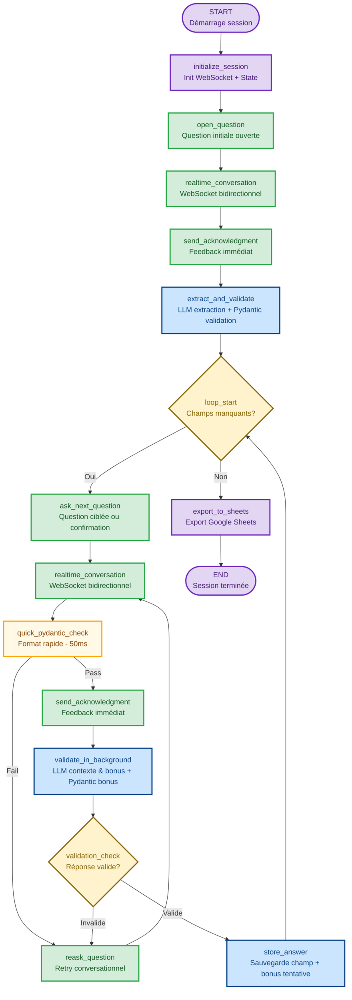

Insurance Real Time Voice AI Form Completion - 29/09/2025 

# MVP : Système d'Entretien Vocal Conversationnel en Temps Réel

## Vue d'ensemble

Ce MVP établit un système d'entretien vocal conversationnel utilisant l'API Realtime d'OpenAI pour créer une expérience interactive naturelle et fluide. Contrairement aux approches traditionnelles où l'utilisateur enregistre un audio, attend la transcription, puis reçoit une réponse, ce système maintient une conversation bidirectionnelle continue avec une latence ultra-basse.

L'architecture exploite la connexion WebSocket persistante de l'API Realtime qui intègre nativement la reconnaissance vocale (STT), le traitement conversationnel intelligent, et la synthèse vocale (TTS). Cette intégration élimine les transitions discontinues et crée une expérience proche d'une conversation téléphonique humaine.

Le MVP introduit une approche d'extraction intelligente : au lieu de poser séquentiellement chaque question, le système commence par une question ouverte ("Pour quelle raison nous appelez-vous aujourd'hui?"), analyse la réponse complète avec Claude Sonnet 4.5, et extrait automatiquement tous les champs identifiables. Il pose ensuite uniquement des questions ciblées pour les informations manquantes, optimisant ainsi le temps de l'utilisateur.

La validation s'effectue en deux couches complémentaires : Pydantic vérifie la structure et les formats (codes postaux, numéros de police, emails), tandis que Claude Sonnet 4.5 valide la cohérence sémantique et contextuelle. Les erreurs de validation déclenchent une redemande conversationnelle naturelle plutôt qu'un message d'erreur froid.

Pour ce MVP, l'interface reste l'interface chat existante (agent-chat-ui) avec intégration WebSocket, établissant les bases techniques avant le déploiement téléphonique de la solution complète.

## Inlcut dans le MVP

Le MVP inclut les capacités essentielles pour démontrer la valeur de l'approche conversationnelle :

(Le but de ce MVP n'est pas la vitesse ou le cout d'une intéraction, mais bien la qualité et l'expérience utilisateur. La vitesse et le cout peuvent être optimisés en deuxième temps)

- **Conversation temps réel bidirectionnelle** : Utilisation complète de l'API Realtime d'OpenAI avec WebSocket persistant pour une expérience vocale fluide et naturelle.

- **Question ouverte initiale** : Approche d'extraction intelligente où une réponse complète permet de remplir plusieurs champs simultanément, réduisant le nombre de questions nécessaires.

- **Loop conversationnel adaptatif** : Le système pose uniquement les questions pour les champs manquants, pas une liste figée de questions séquentielles.

- **Validation robuste bi-couche** : Combinaison de Pydantic (validation structurelle/format) et Claude Sonnet 4.5 (validation sémantique/contextuelle) pour assurer la qualité des données.

- **Retry conversationnel naturel** : Quand une réponse n'est pas validée, le système redemande de manière conversationnelle avec explications claires.

- **Intégration chat existante** : Utilisation d'un agent-chat-ui déjà développé avec ajout de WebSocket pour l'audio bidirectionnel.

- **Export structuré** : Les données validées sont exportées vers Google Sheets dans un format prêt pour intégration avec les systèmes d'assurance.

## Architecture du Système graph



## Comprendre le Flow

### 1. Question Ouverte Initiale : Capturer le Contexte Complet

Le système commence par établir une connexion WebSocket avec l'API Realtime https://platform.openai.com/docs/models/gpt-realtime et pose une question ouverte stratégique : **"Bonjour, est-ce que je pourrais avoir votre nom et la raison de votre appel aujourd'hui?"**

Cette approche diffère radicalement des formulaires traditionnels. Au lieu de demander séquentiellement le nom, puis le numéro de police, puis le type d'assurance, etc., le système invite l'utilisateur à s'exprimer naturellement. Une réponse typique pourrait être : "Bonjour, je m'appelle Marie Tremblay, mon numéro de police est AB123456, et j'aimerais ajouter ma nouvelle voiture à mon assurance auto."

La conversation s'effectue via WebSocket bidirectionnel : le système parle (via TTS intégré de Realtime), l'utilisateur répond (capturé en temps réel via STT intégré), et cette interaction est fluide sans latence perceptible. L'utilisateur ne voit pas de spinner "transcription en cours" - c'est une conversation naturelle.

**Nodes impliqués**: `initialize_session` → `open_question` → `realtime_conversation`

### 2. Extraction Multi-Champs avec Réponse Immédiate (< 200ms)

Une fois la réponse initiale captée, **le système doit d'abord éviter le silence gênant** avant d'effectuer l'extraction lourde. L'extraction de 5-10 champs simultanés par Claude prend 1.2-1.5 secondes - un silence mortel qui donne l'impression d'un système lent dès la première interaction.

**Solution critique pour l'expérience MVP** : Feedback immédiat suivi d'extraction en arrière-plan.

Pour la réponse exemple ci-dessus ("Bonjour, je m'appelle Marie Tremblay, mon numéro de police est AB123456..."), le processus se déroule ainsi :

**Phase 1 - Accusé de Réception Immédiat (< 200ms)** :
- Dès que l'utilisateur termine, le système répond instantanément : "D'accord, laissez-moi noter tout ça..."
- Cette réponse engage 3-4 secondes de parole (suffisant pour masquer l'extraction)
- L'utilisateur ne perçoit AUCUNE attente - conversation reste fluide
- **Premier contact = impression de réactivité**

**Phase 2 - Extraction par Claude (pendant que système parle, 1200ms)** :
Pendant que le système prononce son accusé, Claude analyse la transcription complète :
- Identifie "Marie" comme prénom potentiel (confiance 0.95)
- Identifie "Tremblay" comme nom de famille potentiel (confiance 0.95)
- Identifie "AB123456" comme numéro de police (confiance 0.98)
- Identifie "auto" comme type d'assurance (confiance 0.92)
- Classifie "ajout véhicule" comme raison (confiance 0.90)

**Phase 3 - Validation Pydantic Immédiate (pendant que système parle, 100ms)** :
Chaque champ extrait par Claude est testé contre son validator Pydantic :
- "Marie" → Validator prénom → ✅ Format valide, stocké
- "Tremblay" → Validator nom → ✅ Format valide, stocké
- "AB123456" → Validator police (2 lettres + 6-10 chiffres) → ✅ Parfait, stocké
- "auto" → Validator type (enum: auto/maison/vie) → ✅ Dans la liste, stocké
- "ajout véhicule" → Validator raison (texte libre) → ✅ Stocké

Si un champ échoue la validation Pydantic (exemple: "AB12" trop court), il est rejeté silencieusement - sera redemandé explicitement plus tard. Mieux vaut manquer un champ que stocker une donnée invalide.

**Phase 4 - Transition Naturelle vers Question Suivante** :
Quand le système termine son accusé (~3.5s), l'extraction est complète depuis longtemps. Il enchaîne immédiatement : "Parfait, j'ai noté votre nom Marie Tremblay et votre numéro de police. Quelle est votre adresse actuelle?"

**Gain de latence perçue** :
- Approche sans optimisation : 1.5 secondes de silence complet (impression: "système lent")
- Approche optimisée MVP : 200ms avant feedback, extraction invisible (impression: "système réactif")

Cette phase peut remplir et **valider** 40 à 70% des champs nécessaires en une seule question, réduisant dramatiquement la durée de l'entretien tout en garantissant la qualité structurelle des données ET une excellente première impression.

**Nodes impliqués**: `realtime_conversation` → `send_acknowledgment` (feedback immédiat) → `extract_and_validate` (Claude + Pydantic en parallèle pendant speech)

### 3. Loop Conversationnel Adaptatif avec Réponse Immédiate (< 200ms)

Après l'extraction initiale, le système évalue quels champs obligatoires restent vides. Pour chaque champ manquant, il pose une question ciblée. **L'innovation critique du MVP : le système répond immédiatement (< 200ms) pendant que la validation lourde s'effectue en arrière-plan**, éliminant les silences gênants qui brisent le flow conversationnel naturel.

**Exemple concret du flow avec réponse immédiate et extraction bonus** :

Si l'adresse n'a pas été mentionnée initialement, le système demande : "Parfait Marie, j'ai bien noté votre demande. Quelle est votre adresse actuelle?"

L'utilisateur répond : "123 rue Principale, Montréal, H3A 1B2, et vous pouvez me joindre au 514-555-1234"

**Le système traite alors avec une approche double-vitesse** :

**Phase 1 - Vérification Rapide (50ms)** :
- Pydantic vérifie rapidement le format de base du champ ciblé (adresse)
- Test ultra-rapide : contient des chiffres + rue + code postal?
- Résultat : Format plausible → ✅ Continue

**Phase 2 - Feedback Immédiat au Client (total 200ms depuis fin de parole)** :
- Le système répond IMMÉDIATEMENT via Realtime : "D'accord, j'ai bien noté votre adresse..."
- L'utilisateur n'attend JAMAIS en silence - conversation reste fluide
- **Crucial pour MVP** : Cette réponse rapide masque la latence de validation complexe

**Phase 3 - Validation Approfondie en Arrière-Plan (pendant que le système parle)** :
Pendant que le système prononce son accusé de réception (2-3 secondes de parole), deux processus parallèles s'exécutent :

- **Validation Claude du champ principal** : Vérifie cohérence sémantique de l'adresse québécoise (800ms)
- **Extraction et validation des bonus** :
  - Claude détecte le téléphone "514-555-1234" dans la réponse (inclus dans même appel)
  - Pydantic valide le format téléphone → ✅ (50ms en parallèle)
  - Résultat : Téléphone stocké comme **champ tentative** (needs_confirmation: true)

**Phase 4 - Question Suivante Adaptée (validation déjà terminée)** :
Quand le système termine son accusé de réception, la validation est complète. Il enchaîne immédiatement : "Pour confirmer, je peux vous joindre au 514-555-1234?"

L'utilisateur répond : "Oui, c'est ça"

Le système valide la confirmation, marque le téléphone comme validated=True, et continue vers le prochain champ.

**Gain d'efficacité** : Au lieu de 2 questions complètes (adresse + téléphone), on a 1 question complète + 1 confirmation rapide. L'utilisateur ne répète pas d'informations qu'il a déjà données.

**Garde-fous importants** :
- Maximum 2 champs bonus par réponse (évite la surcharge)
- Bonus acceptés seulement si confiance Claude > 85%
- Bonus DOIVENT passer validation Pydantic (sinon rejetés silencieusement)
- Confirmation toujours demandée (jamais stocké directement comme validé)

Le loop se termine quand tous les champs obligatoires sont remplis ET validés (pas de champs avec needs_confirmation restants).

**Gain de latence perçue** :
- Approche traditionnelle : 900ms de silence après chaque réponse
- Approche optimisée MVP : 200ms avant feedback, validation masquée par la parole du système
- **Résultat : Conversation fluide sans pauses perceptibles**

**Nodes impliqués**: `loop_start` {decision} → `ask_next_question` → `realtime_conversation` → `quick_pydantic_check` (50ms) → `send_acknowledgment` (feedback immédiat) → `validate_in_background` (Claude + bonus pendant que système parle) → `validation_check` {decision} → `store_answer` → retour à `loop_start`

### 4. Retry Conversationnel : Gestion Gracieuse des Erreurs

Quand une réponse échoue la validation, le système n'affiche pas "Erreur : format invalide". Il engage une redemande conversationnelle naturelle expliquant le problème et guidant l'utilisateur.

**Exemple - Prénom avec nom de famille** :
```
Q: "Quel est votre prénom?"
User: "Marie Tremblay"
System: "J'ai noté Marie et Tremblay. Votre prénom est-il juste Marie?"
[Le système a aussi extrait "Tremblay" comme bonus pour le nom de famille]
```

**Exemple - Numéro de police invalide** :
```
Q: "Quel est votre numéro de police?"
User: "123456"
System: "Je note 123456, mais nos numéros de police commencent habituellement
         par deux lettres suivies de chiffres, comme AB123456. Pourriez-vous
         vérifier et me le donner à nouveau?"
```

Le système garde en mémoire le contexte conversationnel complet - il sait ce qui a déjà été dit, ce qui a échoué, combien de tentatives ont été faites, et quels champs bonus ont été extraits. Après 3 tentatives infructueuses sur un champ, il marque ce champ pour révision humaine ultérieure et passe au suivant plutôt que de bloquer l'utilisateur.

Ce retry n'est pas un node séparé qui "relance le process" - c'est une continuation fluide de la conversation via le même WebSocket Realtime.

**Nodes impliqués**: `validation_check` {invalid} → `reask_question` → `realtime_conversation` (retry loop)

### 5. Export Final : Données Structurées vers Google Sheets

Une fois tous les champs obligatoires validés, le système compile les données dans un format structuré et les exporte automatiquement vers Google Sheets. Chaque ligne du spreadsheet représente un entretien complet avec :

- Métadonnées : session_id, timestamp_début, timestamp_fin, durée_totale
- Champs extraits : tous les champs avec leurs valeurs validées
- Statut de validation : scores de confiance par champ
- Flags de révision : champs qui ont nécessité 3+ tentatives

L'export est synchrone pour le MVP - le système attend confirmation que Google Sheets a bien reçu les données avant de terminer la session. Cela assure qu'aucune donnée n'est perdue même si la connexion WebSocket se coupe immédiatement après.

L'utilisateur reçoit une confirmation finale : "Parfait Marie, j'ai bien enregistré toutes vos informations. Un conseiller vous contactera dans les 24 heures pour finaliser l'ajout de votre véhicule. Merci et bonne journée!"

**Nodes impliqués**: `loop_start` {tous champs complets} → `export_to_sheets` → `END`

## Catalogue des Nodes LangGraph

### Nodes de Gestion de Session

#### initialize_session

- **Rôle** : Établir la connexion WebSocket Realtime et initialiser l'état conversationnel
- **Input** : Aucun (point d'entrée du graph)
- **Traitement** :
  - Génère un session_id unique (UUID)
  - Établit la connexion WebSocket persistante avec l'API Realtime d'OpenAI
  - Envoie l'événement `session.update` avec configuration (modèle, voix, paramètres audio)
  - Charge la définition des champs à collecter (schema Pydantic)
  - Initialise le State avec champs vides, compteurs de retry à zéro
  - Configure la détection de tour de parole (turn detection) pour gérer les pauses naturelles
- **Output** : State contenant websocket_session, session_id, fields_schema, extracted_fields={}, retry_counts={}, conversation_history=[]
- **Edges** : Connexion directe vers `open_question`
- **Note** : La connexion WebSocket reste ouverte durant tout l'entretien. Si elle se ferme, le graph doit gérer la reconnexion avec restauration du contexte.

### Nodes Conversationnels (Realtime API)

#### open_question

- **Rôle** : Poser la question initiale ouverte pour capturer un maximum de contexte
- **Input** : State avec websocket_session active
- **Traitement** :
  - Construit le prompt de question ouverte : "Pour quelle raison nous appelez-vous aujourd'hui?"
  - Envoie l'événement `conversation.item.create` avec le message système
  - Envoie l'événement `response.create` pour déclencher la réponse TTS de Realtime
  - Attend la réponse complète de l'utilisateur (détection de fin de tour de parole)
- **Output** : State mis à jour avec current_question="open", waiting_for_response=True
- **Edges** : Connexion directe vers `realtime_conversation` (capture de la réponse)
- **Note** : Cette question est intentionnellement large pour encourager une réponse riche en informations

#### realtime_conversation

- **Rôle** : Gérer l'échange audio bidirectionnel en temps réel via WebSocket
- **Input** : State avec websocket_session et contexte conversationnel
- **Traitement** :
  - Reçoit les événements audio streaming de l'utilisateur via WebSocket
  - L'API Realtime transcrit automatiquement (STT intégré) pendant que l'utilisateur parle
  - Détecte la fin du tour de parole (pause significative ou marqueur explicite)
  - Capture la transcription complète dans `conversation.item.input_audio_transcription.completed`
  - Stocke dans l'historique conversationnel
  - Gère les interruptions potentielles (utilisateur coupe le système)
- **Output** : State avec current_transcription (texte), audio_duration, conversation_history mis à jour
- **Edges** :
  - Après question ouverte → vers `extract_fields`
  - Après question ciblée → vers `validate_pydantic`
  - Après retry → vers `validate_pydantic`
- **Note** : Ce node est réutilisé à plusieurs endroits du flow - c'est le cœur de l'interaction temps réel

#### ask_next_question

- **Rôle** : Formuler et poser soit une question ciblée standard, soit une question de confirmation pour un champ bonus
- **Input** : State avec fields_schema, extracted_fields (incluant champs avec needs_confirmation)
- **Traitement intelligent en 2 cas** :
  - **Cas A - Champ avec bonus tentative** : Si le prochain champ manquant a déjà une valeur stockée avec needs_confirmation=True (issu d'une extraction bonus précédente), génère une question de confirmation au lieu d'une question complète. Exemple : au lieu de "Quel est votre numéro de téléphone?", demande "Pour confirmer, je peux vous joindre au 514-555-1234?" Cette approche est plus naturelle et efficace - l'utilisateur répond juste "Oui" ou "C'est ça" au lieu de répéter l'information complète.
  - **Cas B - Champ vraiment manquant** : Si le champ n'a aucune valeur, génère une question ciblée contextuelle via un prompt template. Les questions sont formulées naturellement en tenant compte du contexte conversationnel (ce qui a déjà été dit, le ton de la conversation). Exemple pour "adresse" : "Parfait Marie, quelle est votre adresse actuelle?" plutôt que le robotique "Veuillez entrer votre adresse."
  - Marque le champ ciblé et le type de question (confirmation vs standard) dans le State pour que la validation sache comment interpréter la réponse.
- **Output** : State avec current_field_targeted, current_question (texte), question_type ("confirmation" ou "standard")
- **Edges** : Connexion directe vers `realtime_conversation` (capture réponse)
- **Note** : Cette intelligence au niveau de la formulation de question réduit dramatiquement les répétitions et améliore l'expérience utilisateur

#### reask_question

- **Rôle** : Redemander une question de manière conversationnelle quand la validation a échoué
- **Input** : State avec validation_results (contient les raisons d'échec) et current_field_targeted
- **Traitement** :
  - Récupère les issues de validation depuis ValidationResult
  - Construit un message explicatif courtois basé sur le type d'erreur :
    - Format invalide : explique le format attendu avec exemple
    - Valeur manquante : guide sur ce qui est nécessaire
    - Incohérence : mentionne le problème détecté
  - Incrémente le retry_counter pour ce champ
  - Vérifie si retry_limit (3) est atteint
  - Si limite atteinte : marque le champ pour révision humaine et passe au suivant
  - Sinon : reformule la question avec l'explication
- **Output** : State avec retry_counts mis à jour, retry_message, needs_human_review (si limite)
- **Edges** :
  - Si retry possible → vers `realtime_conversation` (retry loop)
  - Si limite atteinte → vers `loop_start` (passe au prochain champ)
- **Note** : Maintient le ton conversationnel et courtois - jamais accusateur ou frustré

### Nodes de Processing et Validation

#### quick_pydantic_check

- **Rôle** : Effectuer une vérification ultra-rapide du format pour éviter les silences conversationnels
- **Input** : State avec current_transcription et current_field_targeted
- **Traitement** :
  - Récupère le validator Pydantic pour le champ ciblé
  - Effectue un test de format basique et rapide (50ms maximum)
  - Ne vérifie QUE la structure : format, longueur, pattern regex
  - N'effectue AUCUNE validation sémantique (laissée à Claude)
  - Si échec évident (exemple: "abc" pour un champ numérique) → échec immédiat
  - Si format plausible → passe (même si potentiellement invalide sémantiquement)
- **Output** : State avec quick_check_result={passed: boolean, basic_format_ok: boolean}
- **Edges** :
  - Si passed=True → vers `send_acknowledgment` (feedback immédiat)
  - Si passed=False → vers `reask_question` (erreur de format évidente)
- **Note** : Ce node est la clé de la latence < 200ms. Il sacrifie la précision pour la vitesse - c'est un filtre grossier qui laisse passer les cas douteux pour que Claude décide. Mieux vaut un faux positif ici (corrigé après) qu'un silence gênant.

#### send_acknowledgment

- **Rôle** : Fournir un feedback conversationnel immédiat pendant que le traitement lourd s'exécute en arrière-plan
- **Input** : State avec context (question ouverte ou question ciblée), current_field_targeted (optionnel)
- **Traitement** :
  - **Contexte A - Après question ouverte** : Génère un accusé long (3-4s) pour masquer extraction multi-champs. Exemples : "D'accord, laissez-moi noter tout ça...", "Parfait, je prends bien note de vos informations..."
  - **Contexte B - Après question ciblée** : Génère un accusé court (2-3s) pour masquer validation simple. Exemples : "D'accord, j'ai bien noté", "Parfait, je note ça", "Très bien"
  - Varie les formulations pour éviter la répétition robotique (essentiel pour naturalité)
  - Envoie immédiatement à l'API Realtime pour TTS
  - **Crucial** : Ne bloque PAS - retourne immédiatement après envoi sans attendre fin du TTS
  - Déclenche le traitement background en parallèle (non bloquant)
  - Enregistre le timestamp d'envoi et la durée estimée pour synchronisation
- **Output** : State avec acknowledgment_sent=True, ack_start_time, ack_expected_duration, ack_context
- **Edges** :
  - Depuis question ouverte → vers `extract_and_validate` (extraction parallèle)
  - Depuis question ciblée → vers `validate_in_background` (validation parallèle)
- **Note** : Ce node est utilisé DEUX fois dans le flow avec des durées différentes. Pour la question ouverte, l'accusé doit être plus long (1.2-1.5s d'extraction vs 0.8s de validation). C'est la clé de l'expérience MVP : transformer le traitement lourd invisible en maintenant une conversation fluide.

#### validate_in_background

- **Rôle** : Effectuer la validation complète (Claude + Pydantic bonus) pendant que le système parle l'accusé de réception
- **Input** : State avec current_transcription, current_field_targeted, conversation_history, extracted_fields
- **Traitement** : Identique à l'ancien node `validate_with_context`, mais maintenant exécuté en parallèle avec le TTS
  - **Validation Claude du champ principal** : Sémantique, cohérence, completude (800ms)
  - **Extraction bonus contextuelle** : Cherche max 2 champs additionnels dans la réponse
  - **Validation Pydantic des bonus** : Teste format de chaque bonus (50ms par champ)
  - Attend que l'accusé de réception soit terminé avant de retourner (synchronisation)
  - Si l'accusé prend 2.5s et Claude prend 800ms → validation termine en avance, pas de latence perçue
  - Si Claude prend exceptionnellement 1.5s → ajoute seulement 1s après la fin de l'accusé (acceptable)
- **Output** : State avec primary_validation, bonus_fields_validated (identique structure précédente)
- **Edges** : Connexion directe vers `validation_check`
- **Note** : Ce node est le "travailleur lourd" qui s'exécute silencieusement pendant la parole du système. Architecture critique pour MVP : sacrifie un peu de temps CPU (parallelisation) pour éliminer la latence perçue par l'utilisateur.

#### extract_and_validate

- **Rôle** : Extraire intelligemment tous les champs de la réponse initiale ET valider immédiatement chacun avec Pydantic
- **Input** : State avec current_transcription (réponse initiale longue de la question ouverte)
- **Traitement** :
  - **Phase A - Extraction par Claude** : Envoie la transcription complète à Claude Sonnet 4.5 avec un prompt structuré incluant le schema complet de tous les champs attendus. Claude analyse contextuellement et retourne un JSON avec tous les champs identifiables, leurs valeurs extraites, et un score de confiance pour chacun.
  - **Phase B - Validation Pydantic immédiate** : Pour chaque champ extrait par Claude, teste immédiatement contre le validator Pydantic correspondant. Si le format passe (exemple: "AB123456" match le pattern de numéro de police), le champ est accepté et stocké comme validé. Si Pydantic échoue (exemple: "AB12" trop court), le champ est rejeté silencieusement - il sera redemandé explicitement plus tard. Cette double couche (extraction Claude + validation Pydantic) garantit qu'on ne stocke que des données structurellement valides.
  - **Phase C - Agrégation** : Compile tous les champs qui ont passé les deux validations dans extracted_fields avec leurs métadonnées (confidence, timestamp, source).
- **Output** : State avec extracted_fields (dict contenant uniquement les champs validés par Pydantic), rejected_fields (pour logging/debug)
- **Edges** : Connexion directe vers `loop_start` (évaluation des champs manquants)
- **Note** : Cette extraction + validation unifiée peut remplir et valider 40-70% des champs en une passe, réduisant dramatiquement le nombre de questions nécessaires. La validation Pydantic immédiate évite de stocker des faux positifs que Claude pourrait extraire avec trop d'optimisme.

#### validate_with_context

- **Rôle** : Valider le champ ciblé ET extraire opportunément des champs bonus, le tout avec double validation Pydantic + Claude
- **Input** : State avec current_transcription, current_field_targeted, conversation_history, extracted_fields
- **Traitement en 3 phases** :
  - **Phase 1 - Validation Pydantic du champ ciblé** : Récupère le validator Pydantic pour le champ demandé et teste la transcription. Si le format passe (exemple: "123 rue Principale, H3A 1B2" pour une adresse), extrait la valeur formatée. Si échoue (exemple: "123456" pour un numéro de police qui nécessite 2 lettres au début), marque comme invalide.
  - **Phase 2 - Validation et Extraction Contextuelle par Claude** : Envoie à Claude Sonnet 4.5 un prompt complet incluant la question posée, la réponse, l'historique conversationnel, et tous les champs déjà validés. Claude accomplit trois tâches simultanément : (A) Valide sémantiquement le champ ciblé (cohérence, completude, contradictions potentielles), (B) Cherche intelligemment d'autres informations dans la réponse (extraction bonus), et (C) Pour chaque bonus détecté, évalue la confiance d'extraction. Exemple : si la question était "Votre adresse?" et l'utilisateur dit "123 rue Principale, H3A 1B2, et mon téléphone est 514-555-1234", Claude valide l'adresse ET extrait le téléphone comme bonus avec confiance 0.92.
  - **Phase 3 - Validation Pydantic des Bonus** : Pour chaque champ bonus extrait par Claude (max 2 pour éviter surcharge), teste immédiatement avec le validator Pydantic correspondant. Si le bonus passe (exemple: "514-555-1234" match le format téléphone), il est accepté comme champ tentative avec needs_confirmation=True. Si Pydantic échoue, le bonus est rejeté silencieusement. Les bonus sont limités à confiance Claude > 0.85 pour éviter les faux positifs.
- **Output** : State avec primary_validation={is_valid, extracted_value, issues}, bonus_fields_validated={field_name: {value, confidence, needs_confirmation}}
- **Edges** : Connexion directe vers `validation_check` (décision sur champ primaire)
- **Note** : Ce node unifie la validation stricte (Pydantic) et l'intelligence contextuelle (Claude) tout en optimisant l'efficacité via l'extraction bonus. La latence reste acceptable car Claude traite validation + extraction en un seul appel API.

#### validation_check

- **Rôle** : Décision finale sur la validité de la réponse en combinant Pydantic et Claude
- **Input** : State avec pydantic_validation et claude_validation
- **Traitement** :
  - Évalue les deux validations selon une logique ET avec pondération :
    - Pydantic DOIT passer (is_valid=True) - non négociable
    - Claude doit avoir confidence > 0.7 ET is_valid=True
  - Si les deux passent : retourne "valid"
  - Si l'une échoue :
    - Vérifie le retry_count pour ce champ
    - Si < 3 tentatives : retourne "invalid" (retry)
    - Si >= 3 tentatives : retourne "valid" (accepte malgré doute, flag pour révision)
  - Agrège les issues de validation pour le retry message
- **Output** : Décision de routing (string) : "valid" ou "invalid"
- **Edges** :
  - Si "valid" → vers `store_answer`
  - Si "invalid" → vers `reask_question`
- **Note** : Cette logique évite de bloquer l'utilisateur indéfiniment sur un champ problématique

### Nodes de Décision et Persistence

#### loop_start

- **Rôle** : Déterminer si tous les champs obligatoires sont complètement validés ou s'il reste des questions/confirmations à faire
- **Input** : State avec fields_schema (définition des champs requis) et extracted_fields (champs remplis, incluant tentatives)
- **Traitement intelligent considérant 3 états possibles** :
  - Itère sur tous les champs marqués required=True dans le schema. Pour chaque champ requis, vérifie trois cas :
    - **Cas 1 - Champ absent** : N'existe pas du tout dans extracted_fields → ajoute à missing_fields
    - **Cas 2 - Champ tentative** : Existe mais avec validated=False et needs_confirmation=True (issu d'extraction bonus) → ajoute à missing_fields car nécessite confirmation
    - **Cas 3 - Champ validé** : Existe avec validated=True → considéré comme complet, ignore
  - Priorise les missing_fields selon importance (champs critiques d'abord) ET type (champs absents avant champs à confirmer, car poser une nouvelle question peut révéler d'autres bonus)
  - Retourne décision basée sur la liste finale :
    - Liste vide (tous champs existent ET tous validated=True) → "done"
    - Liste non vide (au moins un champ absent ou à confirmer) → "more"
- **Output** : Décision de routing (string) : "more" (questions/confirmations restantes) ou "done" (tout validé)
- **Edges** :
  - Si "more" → vers `ask_next_question` (continue loop avec question standard ou confirmation)
  - Si "done" → vers `export_to_sheets` (tous champs validés, termine entretien)
- **Note** : Ce node est le cœur du loop adaptatif - il détermine dynamiquement la fin ET distingue les champs vraiment manquants des champs à confirmer, permettant à ask_next_question de formuler la bonne question

#### store_answer

- **Rôle** : Sauvegarder le champ primaire validé ET les champs bonus tentative dans le State
- **Input** : State avec current_field_targeted, primary_validation, bonus_fields_validated
- **Traitement en 2 parties** :
  - **Partie A - Stockage du champ primaire** : Récupère la valeur validée du champ ciblé et crée un objet FieldValue structuré contenant la donnée formatée, le score de confiance combiné Pydantic+Claude, l'horodatage de validation, le nombre de tentatives nécessaires, et un flag validated=True indiquant que ce champ est complètement validé. Ce champ est stocké dans extracted_fields[current_field_targeted] et compte comme officiellement complété.
  - **Partie B - Stockage des bonus comme tentatives** : Pour chaque champ bonus qui a passé la double validation Pydantic+Claude (max 2), crée un objet similaire mais avec validated=False et needs_confirmation=True. Ces champs bonus sont stockés dans extracted_fields mais ne comptent pas encore comme validés - ils nécessitent une confirmation explicite de l'utilisateur lors d'une prochaine question. Cette approche permet d'optimiser le flow tout en maintenant la rigueur de validation. Si un champ existe déjà dans extracted_fields (déjà validé précédemment), le bonus est ignoré pour éviter les écrasements.
  - Met à jour les statistiques de session et réinitialise les variables temporaires de validation.
- **Output** : State avec extracted_fields enrichi (champs validés + bonus tentative), statistics mises à jour
- **Edges** : Connexion directe vers `loop_start` (évalue champs manquants et champs à confirmer)
- **Note** : La distinction validated=True vs validated=False+needs_confirmation est cruciale pour que loop_start sache quels champs sont vraiment complets vs lesquels nécessitent confirmation

#### export_to_sheets

- **Rôle** : Compiler et exporter les données validées vers Google Sheets
- **Input** : State avec extracted_fields (tous champs validés), session_id, timestamps
- **Traitement** :
  - Compile toutes les données en un dictionnaire structuré :
    - Métadonnées : session_id, start_time, end_time, total_duration
    - Champs : toutes les clé-valeurs de extracted_fields
    - Qualité : scores de confiance moyens, nombre de retries total, champs flaggés pour révision
  - Formate selon le schema Google Sheets (ordre des colonnes, types)
  - Appelle l'API Google Sheets pour append une nouvelle ligne
  - Attend la confirmation de succès (synchrone pour MVP)
  - En cas d'erreur d'export :
    - Log l'erreur avec toutes les données pour debugging
    - Sauvegarde locale de backup (JSON file temporaire)
    - Retourne error_state pour gestion d'erreur
- **Output** : State avec export_status="success" ou "failed", export_timestamp, sheets_row_id
- **Edges** : Connexion directe vers `END` (fin du graph)
- **Note** : L'export est bloquant pour le MVP - on ne termine pas tant que les données ne sont pas persistées


## Critères de Succès Centrés Utilisateur

Ces critères définissent ce que les testeurs utilisateurs doivent ressentir et expérimenter pour valider le MVP. Ils sont mesurables via observation, questionnaires post-test, et métriques utilisateur.

### Fluidité : L'Entretien Se Sent Naturel

**Ce que l'utilisateur expérimente :**
- Peut parler sans regarder de timer ou attendre un "bip"
- N'a pas besoin de cliquer sur "Terminer enregistrement" - le système détecte les pauses naturelles
- Les réponses du système arrivent rapidement, comme dans une vraie conversation
- Ne ressent pas de frustration liée à l'attente ou aux délais

**Mesure de succès :**
- 8/10 testeurs décrivent la conversation comme "naturelle" ou "fluide"
- **Latence perçue < 200ms** : Feedback immédiat après chaque réponse (via quick_check + acknowledgment)
- Validation lourde invisible : Claude s'exécute pendant que le système parle, zéro pause perceptible
- Moins de 2 plaintes par session sur "le système est trop lent"
- Aucun testeur ne demande "Est-ce que je dois cliquer quelque chose?"

### Compréhension : Le Système "M'Entend" Correctement

**Ce que l'utilisateur expérimente :**
- Ses réponses sont comprises correctement la première fois (>80% des cas)
- Quand il dit "AB123456", le système répète correctement "AB123456"
- Ses noms propres (même complexes) sont captés avec précision acceptable
- Les chiffres et codes importants ne sont pas mal transcrits

**Mesure de succès :**
- Taux de transcription correcte > 85% sur audio clair (vérifié manuellement sur échantillon)
- Moins de 1.5 retries moyens par champ (indique bonne compréhension première passe)
- 7/10 testeurs répondent "Oui" à "Le système a-t-il bien compris vos réponses?"
- Zéro erreur critique sur champs sensibles (numéro de police, montants)

### Intelligence : Le Système "Comprend" Mon Besoin

**Ce que l'utilisateur expérimente :**
- Quand il mentionne plusieurs informations dans sa réponse initiale, le système les capte toutes
- Les questions posées par la suite sont pertinentes et ne redemandent pas ce qui a déjà été dit
- Le système semble "intelligent" - pas robotique
- L'utilisateur a l'impression d'être compris au-delà de simples mots-clés

**Mesure de succès :**
- Taux d'extraction multi-champs > 50% (au moins 2 champs extraits de la réponse ouverte)
- 8/10 testeurs répondent positivement à "Le système semblait-il comprendre votre situation?"
- Aucune question redondante (re-demander ce qui a déjà été donné)
- Les testeurs utilisent des mots comme "intelligent", "utile", "efficace" dans feedback ouvert

### Clarté : Je Sais Toujours Quoi Faire

**Ce que l'utilisateur expérimente :**
- Quand une réponse n'est pas acceptée, comprend immédiatement pourquoi
- Les messages d'erreur ou de clarification sont clairs et actionnables
- Sait toujours si c'est son tour de parler ou d'attendre
- Ne se sent jamais perdu ou confus sur l'état de la conversation

**Mesure de succès :**
- 9/10 testeurs comprennent pourquoi une réponse a été rejetée (après retry)
- Zéro cas où un testeur dit "Je ne sais pas quoi faire maintenant"
- Les indicateurs visuels (microphone actif, système qui parle) sont remarqués et compris
- Moins de 1 demande de clarification par session ("Qu'est-ce que je dois dire?")

### Efficacité : Ça Va Vite, Je Gagne du Temps

**Ce que l'utilisateur expérimente :**
- L'entretien complet se termine plus vite qu'espéré
- N'a pas besoin de chercher des documents ou informations en dehors de ce qu'il connaît
- Pas de questions inutiles ou trop nombreuses
- A l'impression d'avoir gagné du temps comparé à un formulaire web ou un appel classique

**Mesure de succès :**
- Durée moyenne entretien de 5-7 questions : < 5 minutes
- 7/10 testeurs trouvent le processus "plus rapide que prévu"
- Nombre moyen de questions posées : 5 à 7 (grâce à extraction intelligente)
- Taux d'abandon < 10% (les utilisateurs vont jusqu'au bout)

### Confiance : Mes Informations Sont Bien Capturées

**Ce que l'utilisateur expérimente :**
- Se sent confiant que ses informations ont été correctement enregistrées
- N'a pas de doute sur l'exactitude des données au moment de terminer
- Si incertain, a eu l'opportunité de corriger ou clarifier
- Termine l'entretien avec sérénité, pas d'anxiété sur "est-ce que c'est bon?"

**Mesure de succès :**
- 8/10 testeurs répondent "Très confiant" ou "Confiant" à "Confiance dans l'exactitude des données capturées?"
- Aucun testeur ne demande explicitement "Puis-je revoir mes réponses?" (signe de doute)
- Feedback positif sur messages de confirmation ("J'ai bien noté que...")
- Moins de 5% de taux de rappel post-entretien pour corriger des erreurs

### Satisfaction : J'Ai Aimé Cette Expérience

**Ce que l'utilisateur expérimente :**
- Trouve l'expérience agréable, voire étonnamment positive
- Préfère cette méthode à un formulaire web traditionnel
- Recommanderait cette approche à d'autres
- Aucune frustration majeure mémorable

**Mesure de succès :**
- Score NPS (Net Promoter Score) > 40 ("Recommanderiez-vous cette méthode?")
- 7/10 testeurs choisissent "Entretien vocal" vs "Formulaire web" quand demandé
- Feedback qualitatif contient des mots positifs : "facile", "agréable", "pratique", "moderne"
- Zéro testeur qui termine en état de frustration visible ou verbalisée

---

`★ Insight ─────────────────────────────────────`
Le MVP intègre deux innovations architecturales critiques : (1) L'API Realtime élimine les transitions discontinues (upload/transcribe/TTS séparés), créant une conversation bidirectionnelle fluide, et (2) L'architecture de validation parallèle masque complètement TOUTES les latences LLM derrière des accusés de réception conversationnels - qu'il s'agisse de l'extraction initiale multi-champs (1.2s masquée par 3-4s de parole) ou des validations ciblées (0.8s masquée par 2-3s). Résultat : latence perçue < 200ms partout, zéro silence gênant du début à la fin. Cette combinaison transforme l'expérience de "formulaire vocal robotique avec pauses frustrantes" à "conversation naturelle et ultra-réactive" - exactement ce qui inspire confiance chez les utilisateurs dès la première interaction.
`─────────────────────────────────────────────────`

Ce MVP valide l'hypothèse centrale : une conversation vocale temps réel avec extraction intelligente ET réactivité optimisée (< 200ms) peut collecter des informations d'assurance plus efficacement qu'un formulaire traditionnel, tout en offrant une expérience utilisateur supérieure qui élimine les frustrations liées aux silences et latences perceptibles.
