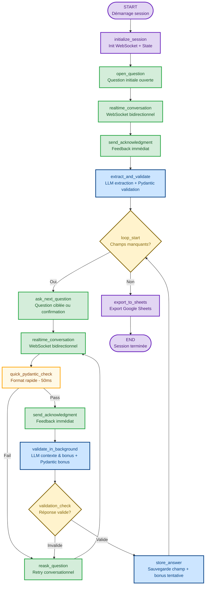

Insurance Real Time Voice AI Form Completion - 29/09/2025 

# MVP : Système d'Entretien Vocal Conversationnel en Temps Réel

## Vue d'ensemble

Ce MVP établit un système d'entretien vocal conversationnel utilisant l'API Realtime d'OpenAI pour créer une expérience interactive naturelle et fluide. Contrairement aux approches traditionnelles où l'utilisateur enregistre un audio, attend la transcription, puis reçoit une réponse, ce système maintient une conversation bidirectionnelle continue avec une latence ultra-basse.

L'architecture exploite la connexion WebSocket persistante de l'API Realtime qui intègre nativement la reconnaissance vocale (STT), le traitement conversationnel intelligent, et la synthèse vocale (TTS). Cette intégration élimine les transitions discontinues et crée une expérience proche d'une conversation téléphonique humaine.

Le MVP introduit une approche d'extraction intelligente : au lieu de poser séquentiellement chaque question, le système commence par une question ouverte ("Pour quelle raison nous appelez-vous aujourd'hui?"), analyse la réponse complète avec Claude Sonnet 4.5, et extrait automatiquement tous les champs identifiables. Il pose ensuite uniquement des questions ciblées pour les informations manquantes, optimisant ainsi le temps de l'utilisateur.

La validation s'effectue en deux couches complémentaires : Pydantic vérifie la structure et les formats (codes postaux, numéros de police, emails), tandis que Claude Sonnet 4.5 valide la cohérence sémantique et contextuelle. Les erreurs de validation déclenchent une redemande conversationnelle naturelle plutôt qu'un message d'erreur froid.

Pour ce MVP, l'interface reste l'interface chat existante (agent-chat-ui) avec intégration WebSocket, établissant les bases techniques avant le déploiement téléphonique de la solution complète.

## Inlcut dans le MVP

Le MVP inclut les capacités essentielles pour démontrer la valeur de l'approche conversationnelle :

(Le but de ce MVP n'est pas la vitesse ou le cout d'une intéraction, mais bien la qualité et l'expérience utilisateur. La vitesse et le cout peuvent être optimisés en deuxième temps)

- **Conversation temps réel bidirectionnelle** : Utilisation complète de l'API Realtime d'OpenAI avec WebSocket persistant pour une expérience vocale fluide et naturelle.

- **Question ouverte initiale** : Approche d'extraction intelligente où une réponse complète permet de remplir plusieurs champs simultanément, réduisant le nombre de questions nécessaires.

- **Loop conversationnel adaptatif** : Le système pose uniquement les questions pour les champs manquants, pas une liste figée de questions séquentielles.

- **Validation robuste bi-couche** : Combinaison de Pydantic (validation structurelle/format) et Claude Sonnet 4.5 (validation sémantique/contextuelle) pour assurer la qualité des données.

- **Retry conversationnel naturel** : Quand une réponse n'est pas validée, le système redemande de manière conversationnelle avec explications claires.

- **Intégration chat existante** : Utilisation d'un agent-chat-ui déjà développé avec ajout de WebSocket pour l'audio bidirectionnel.

- **Export structuré** : Les données validées sont exportées vers Google Sheets dans un format prêt pour intégration avec les systèmes d'assurance.

## Stack 

- API Realtime d'OpenAI avec WebSocket
- LLM model like Anthropic or OpenAI
- Framework : LangGraph(python), Botpress or Voiceflow
- Google sheet (for prototype)

## Architecture du Système graph



## Comprendre le Flow

### 1. Question Ouverte Initiale : Capturer le Contexte Complet

Le système commence par établir une connexion WebSocket avec l'API Realtime https://platform.openai.com/docs/models/gpt-realtime et pose une question ouverte stratégique : **"Bonjour, est-ce que je pourrais avoir votre nom et la raison de votre appel aujourd'hui?"**

Cette approche diffère radicalement des formulaires traditionnels. Au lieu de demander séquentiellement le nom, puis le numéro de police, puis le type d'assurance, etc., le système invite l'utilisateur à s'exprimer naturellement. Une réponse typique pourrait être : "Bonjour, je m'appelle Marie Tremblay, mon numéro de police est AB123456, et j'aimerais ajouter ma nouvelle voiture à mon assurance auto."

La conversation s'effectue via WebSocket bidirectionnel : le système parle (via TTS intégré de Realtime), l'utilisateur répond (capturé en temps réel via STT intégré), et cette interaction est fluide sans latence perceptible. L'utilisateur ne voit pas de spinner "transcription en cours" - c'est une conversation naturelle.

**Nodes impliqués**: `initialize_session` → `open_question` → `realtime_conversation`

### 2. Extraction Multi-Champs avec Réponse Immédiate (< 200ms)

Une fois la réponse initiale captée, **le système doit d'abord éviter le silence gênant** avant d'effectuer l'extraction lourde. L'extraction de 5-10 champs simultanés par Claude prend 1.2-1.5 secondes - un silence mortel qui donne l'impression d'un système lent dès la première interaction.

**Solution critique pour l'expérience MVP** : Feedback immédiat suivi d'extraction en arrière-plan.

Pour la réponse exemple ci-dessus ("Bonjour, je m'appelle Marie Tremblay, mon numéro de police est AB123456..."), le processus se déroule ainsi :

**Phase 1 - Accusé de Réception Immédiat (< 200ms)** :
- Dès que l'utilisateur termine, le système répond instantanément : "D'accord, laissez-moi noter tout ça..."
- Cette réponse engage 3-4 secondes de parole (suffisant pour masquer l'extraction)
- L'utilisateur ne perçoit AUCUNE attente - conversation reste fluide
- **Premier contact = impression de réactivité**

**Phase 2 - Extraction par Claude (pendant que système parle, 1200ms)** :
Pendant que le système continue avec la réponse instantanée, Claude analyse la transcription complète :

- Identifie "Marie" comme prénom potentiel (confiance 0.95)
- Identifie "Tremblay" comme nom de famille potentiel (confiance 0.95)
- Identifie "AB123456" comme numéro de police (confiance 0.98)
- Identifie "auto" comme type d'assurance (confiance 0.92)
- Classifie "ajout véhicule" comme raison (confiance 0.90)

**Phase 3 - Validation Pydantic Immédiate (pendant que système parle, 100ms)** :
Chaque champ extrait par Claude est testé contre son validator Pydantic :
- "Marie" → Validator prénom → ✅ Format valide, stocké
- "Tremblay" → Validator nom → ✅ Format valide, stocké
- "AB123456" → Validator police (2 lettres + 6-10 chiffres) → ✅ Parfait, stocké
- "auto" → Validator type (enum: auto/maison/vie) → ✅ Dans la liste, stocké
- "ajout véhicule" → Validator raison (texte libre) → ✅ Stocké

Si un champ échoue la validation Pydantic (exemple: "AB12" trop court), il est rejeté silencieusement - sera redemandé explicitement plus tard. Mieux vaut manquer un champ que stocker une donnée invalide.

**Phase 4 - Transition Naturelle vers Question Suivante** :
Quand le système termine son accusé (~3.5s), l'extraction est déjà complète. Il enchaîne immédiatement : "Parfait, j'ai noté votre nom Marie Tremblay et votre numéro de police. Quelle est votre adresse actuelle?"

**Gain de latence perçue** :

- Approche sans optimisation : 3 secondes de silence complet (impression: "système lent")
- Approche optimisée MVP : 200ms avant feedback, extraction invisible (impression: "système réactif")

Cette phase peut remplir et **valider** 40 à 70% des champs nécessaires en une seule question, réduisant dramatiquement la durée de l'entretien tout en garantissant la qualité structurelle des données ET une excellente première impression.

**Nodes impliqués**: `realtime_conversation` → `send_acknowledgment` (feedback immédiat) → `extract_and_validate` (Claude + Pydantic en parallèle pendant speech)

### 3. Loop Conversationnel Adaptatif avec Réponse Immédiate (< 200ms)

Après l'extraction initiale, le système évalue quels champs obligatoires restent vides. Pour chaque champ manquant, il pose une question ciblée. **L'innovation critique du MVP : le système répond immédiatement (< 200ms) pendant que la validation lourde s'effectue en arrière-plan**, éliminant les silences gênants qui brisent le flow conversationnel naturel.

**Exemple concret du flow avec réponse immédiate et extraction bonus** :

Si l'adresse n'a pas été mentionnée initialement, le système demande : "Parfait Marie, j'ai bien noté votre demande. Quelle est votre adresse actuelle?"

L'utilisateur répond : "123 rue Principale, Montréal, H3A 1B2, et vous pouvez me joindre au 514-555-1234"

**Le système traite alors avec une approche double-vitesse** :

**Phase 1 - Vérification Rapide (50ms)** :
- Pydantic vérifie rapidement le format de base du champ ciblé (adresse)
- Test ultra-rapide : contient des chiffres + rue + code postal?
- Résultat : Format plausible → ✅ Continue

**Phase 2 - Feedback Immédiat au Client (total 200ms depuis fin de parole)** :
- Le système répond IMMÉDIATEMENT via Realtime : "D'accord, j'ai bien noté votre adresse..."
- L'utilisateur n'attend JAMAIS en silence - conversation reste fluide
- **Crucial pour MVP** : Cette réponse rapide masque la latence de validation complexe

**Phase 3 - Validation Approfondie en Arrière-Plan (pendant que le système parle)** :
Pendant que le système continue avec la réponse instantanée (2-3 secondes de parole), deux processus parallèles s'exécutent :

- **Validation Claude du champ principal** : Vérifie cohérence sémantique de l'adresse québécoise (800ms)
- **Extraction et validation des bonus** :
  - Claude détecte le téléphone "514-555-1234" dans la réponse (inclus dans même appel)
  - Pydantic valide le format téléphone → ✅ (50ms en parallèle)
  - Résultat : Téléphone stocké comme **champ tentative** (needs_confirmation: true)

**Phase 4 - Question Suivante Adaptée (validation déjà terminée)** :
Quand le système continue avec la réponse instantanée, la validation est complète. Il enchaîne immédiatement : "Pour confirmer, je peux vous joindre au 514-555-1234?"

L'utilisateur répond : "Oui, c'est ça"

Le système valide la confirmation, marque le téléphone comme validated=True, et continue vers le prochain champ.

**Gain d'efficacité** : Au lieu de 2 questions complètes (adresse + téléphone), on a 1 question complète + 1 confirmation rapide. L'utilisateur ne répète pas d'informations qu'il a déjà données.

**Garde-fous importants** :
- Maximum 2 champs bonus par réponse (évite la surcharge)
- Bonus acceptés seulement si confiance Claude > 85%
- Bonus DOIVENT passer validation Pydantic (sinon rejetés silencieusement)
- Confirmation toujours demandée (jamais stocké directement comme validé)

Le loop se termine quand tous les champs obligatoires sont remplis ET validés (pas de champs avec needs_confirmation restants).

**Gain de latence perçue** :
- Approche traditionnelle : 900ms de silence après chaque réponse
- Approche optimisée MVP : 200ms avant feedback, validation masquée par la parole du système
- **Résultat : Conversation fluide sans pauses perceptibles**

**Nodes impliqués**: `loop_start` {decision} → `ask_next_question` → `realtime_conversation` → `quick_pydantic_check` (50ms) → `send_acknowledgment` (feedback immédiat) → `validate_in_background` (Claude + bonus pendant que système parle) → `validation_check` {decision} → `store_answer` → retour à `loop_start`

### 4. Retry Conversationnel : Gestion Gracieuse des Erreurs

Quand une réponse échoue la validation, le système n'affiche pas "Erreur : format invalide". Il engage une redemande conversationnelle naturelle expliquant le problème et guidant l'utilisateur.

**Exemple - Prénom avec nom de famille** :
```
Q: "Quel est votre prénom?"
User: "Marie Tremblay"
System: "J'ai noté Marie et Tremblay. Votre prénom est-il juste Marie?"
[Le système a aussi extrait "Tremblay" comme bonus pour le nom de famille]
```

**Exemple - Numéro de police invalide** :
```
Q: "Quel est votre numéro de police?"
User: "123456"
System: "Je note 123456, mais nos numéros de police commencent habituellement
         par deux lettres suivies de chiffres, comme AB123456. Pourriez-vous
         vérifier et me le donner à nouveau?"
```

Le système garde en mémoire le contexte conversationnel complet - il sait ce qui a déjà été dit, ce qui a échoué, combien de tentatives ont été faites, et quels champs bonus ont été extraits. Après 3 tentatives infructueuses sur un champ, il marque ce champ pour révision humaine ultérieure et passe au suivant plutôt que de bloquer l'utilisateur.

Ce retry n'est pas un node séparé qui "relance le process" - c'est une continuation fluide de la conversation via le même WebSocket Realtime.

**Nodes impliqués**: `validation_check` {invalid} → `reask_question` → `realtime_conversation` (retry loop)

### 5. Export Final : Données Structurées vers Google Sheets

Une fois tous les champs obligatoires validés, le système compile les données dans un format structuré et les exporte automatiquement vers Google Sheets. Chaque ligne du spreadsheet représente un entretien complet avec :

- Métadonnées : session_id, timestamp_début, timestamp_fin, durée_totale
- Champs extraits : tous les champs avec leurs valeurs validées
- Statut de validation : scores de confiance par champ
- Flags de révision : champs qui ont nécessité 3+ tentatives

L'export est synchrone pour le MVP - le système attend confirmation que Google Sheets a bien reçu les données avant de terminer la session. Cela assure qu'aucune donnée n'est perdue même si la connexion WebSocket se coupe immédiatement après.

L'utilisateur reçoit une confirmation finale : "Parfait Marie, j'ai bien enregistré toutes vos informations. Un conseiller vous contactera dans les 24 heures pour finaliser l'ajout de votre véhicule. Merci et bonne journée!"

**Nodes impliqués**: `loop_start` {tous champs complets} → `export_to_sheets` → `END`


---

## Critères de Succès Centrés Utilisateur

Ces critères définissent ce que les testeurs utilisateurs doivent ressentir et expérimenter pour valider le MVP.

### 1. Fluidité - L'Entretien Se Sent Naturel

Mesure de succès:
- Latence perçue < 200ms sur toutes les interactions
- 8/10 testeurs décrivent la conversation comme "naturelle" ou "fluide"
- Zéro pause silencieuse de plus de 500ms pendant la conversation

### 2. Intelligence - Le Système Comprend Mon Besoin

Mesure de succès:
- Taux d'extraction multi-champs > 50% (au moins 2 champs extraits de la réponse ouverte)
- Aucune question redondante (re-demander ce qui a déjà été donné)
- 8/10 testeurs répondent positivement à "Le système semblait-il comprendre votre situation?"

### 3. Efficacité - Ça Va Vite, Je Gagne du Temps

Mesure de succès:
- Durée moyenne entretien : < 5 minutes pour 6 champs
- Nombre moyen de questions posées : 5-7 (au lieu de 6+)
- Taux d'abandon < 10%

### 4. Satisfaction Globale

Mesure de succès:
- Score NPS > 40
- 7/10 testeurs préfèrent cette méthode vs formulaire web
- Zéro frustration majeure verbalisée

---

`★ Insight ─────────────────────────────────────`
Le MVP intègre deux innovations architecturales critiques : (1) L'API Realtime élimine les transitions discontinues (upload/transcribe/TTS séparés), créant une conversation bidirectionnelle fluide, et (2) L'architecture de validation parallèle masque complètement TOUTES les latences LLM derrière des accusés de réception conversationnels - qu'il s'agisse de l'extraction initiale multi-champs (1.2s masquée par 3-4s de parole) ou des validations ciblées (0.8s masquée par 2-3s). Résultat : latence perçue < 200ms partout, zéro silence gênant du début à la fin. Cette combinaison transforme l'expérience de "formulaire vocal robotique avec pauses frustrantes" à "conversation naturelle et ultra-réactive" - exactement ce qui inspire confiance chez les utilisateurs dès la première interaction.
`─────────────────────────────────────────────────`

Ce MVP valide l'hypothèse centrale : une conversation vocale temps réel avec extraction intelligente ET réactivité optimisée (< 200ms) peut collecter des informations d'assurance plus efficacement qu'un formulaire traditionnel, tout en offrant une expérience utilisateur supérieure qui élimine les frustrations liées aux silences et latences perceptibles.
