Insurance Real Time Voice AI Form Completion - 29/09/2025

# User Flow - Conversation Réelle avec Marie

## Scénario

Marie Tremblay appelle pour ajouter un véhicule à son assurance auto.

**Durée totale:** ~2 minutes
**Questions posées:** 4 (au lieu de 6 grâce à l'extraction intelligente)
**Latence perçue:** < 200ms partout
**Champs collectés:** Prénom, Nom, Numéro de police, Adresse, Téléphone, Date de naissance

---

---
## Insights Techniques

`★ Insight 
La clé du MVP n'est pas la technologie (Realtime API + Claude), mais l'architecture de latence masqué créer par l'ullusion et le process en parallèle. Sans les accusés de réception immédiats qui déclenchent le processing en parallèle, cette solution serait perçue comme "un robot lent qui réfléchit trop longtemps". Avec cette architecture, elle devient "une conversation naturelle avec un assistant ultra-réactif". La différence entre lent et naturel MVP tient à ces 200ms.`

---

## Userflow - Flowchart

Voici le scénario en flowchart de Marie qui appel la compagnie d'assurance pour ajouter une police d'assurance de voiture :

```mermaid
flowchart TD
    START([DEBUT Marie appelle])
    Q1[Question Ouverte<br/>Bonjour votre nom et raison?]
    R1[Marie repond<br/>Marie Tremblay AB123456 ajouter voiture]
    FAST1[Reponse Immediate 50ms<br/>D accord laissez-moi noter]
    LLM1[Claude Extraction 1.2s<br/>Extrait 4 champs]
    PYD1[Pydantic Validation 100ms<br/>4 valides 2 manquants]
    LOOP1{Loop Check<br/>Champs manquants?}
    Q2[Question Ciblee<br/>Quelle est votre adresse?]
    R2[Marie repond<br/>123 rue Principale H3A 1B2 514-555-1234]
    FAST2[Reponse Immediate 50ms<br/>D accord bien note]
    LLM2[Claude Validation 800ms<br/>Adresse OK + Tel bonus]
    PYD2[Pydantic Bonus 50ms<br/>Tel valide tentative]
    LOOP2{Loop Check<br/>Bonus a confirmer?}
    Q3[Confirmation<br/>Pour confirmer 514-555-1234?]
    R3[Marie Oui c est ca]
    FAST3[Reponse Immediate 30ms]
    LLM3[Claude Validation 300ms<br/>Confirmation positive]
    LOOP3{Loop Check<br/>Champs manquants?}
    Q4[Question Ciblee<br/>Date de naissance?]
    R4[Marie 1985]
    CHECK1{Quick Check Format OK?}
    RETRY[Retry Conversationnel<br/>Besoin jour et mois<br/>comme 15 janvier 1985]
    R5[Marie 15 janvier 1985]
    FAST4[Reponse Immediate 50ms]
    LLM4[Claude Validation 800ms<br/>Date valide]
    LOOP4{Loop Check<br/>Tous champs valides?}
    EXPORT[Export Sheets 100ms<br/>Row ID 12847]
    END([FIN Merci Marie])

    START --> Q1 --> R1 --> FAST1 --> LLM1 --> PYD1 --> LOOP1
    LOOP1 -->|Oui| Q2 --> R2 --> FAST2 --> LLM2 --> PYD2 --> LOOP2
    LOOP2 -->|Oui| Q3 --> R3 --> FAST3 --> LLM3 --> LOOP3
    LOOP3 -->|Oui| Q4 --> R4 --> CHECK1
    CHECK1 -->|Non| RETRY --> R5 --> FAST4
    CHECK1 -->|Oui| FAST4 --> LLM4 --> LOOP4
    LOOP4 -->|Non| EXPORT --> END

    classDef conversationNode fill:#d4edda,stroke:#28a745,stroke-width:2.5px,color:#155724
    classDef processingNode fill:#cce5ff,stroke:#004085,stroke-width:2.5px,color:#004085
    classDef decisionNode fill:#fff3cd,stroke:#856404,stroke-width:2.5px,color:#856404
    classDef systemNode fill:#e2d6f3,stroke:#6c25be,stroke-width:2.5px,color:#4a1a7a
    classDef fastNode fill:#fff9e6,stroke:#ffa500,stroke-width:2.5px,color:#8b4500

    class Q1,Q2,Q3,Q4,R1,R2,R3,R4,R5,RETRY conversationNode
    class LLM1,LLM2,LLM3,LLM4,PYD1,PYD2 processingNode
    class LOOP1,LOOP2,LOOP3,LOOP4,CHECK1 decisionNode
    class START,END,EXPORT systemNode
    class FAST1,FAST2,FAST3,FAST4 fastNode
```

## Userflow de Marie mais avec processus technique - Sequence

### Légende

🗣️ **Marie parle** - Ce que l'utilisateur dit
🤖 **Système répond** - Réponse vocale immédiate (TTS dans Realtime)
⚙️ **Processing** - Traitement en arrière-plan (invisible pour Marie)
⚡ **Latence** - Temps perçu par l'utilisateur (< 200ms)
⏱️ **Durée** - Temps réel de processing (masqué par la parole)
✅ **Validation OK** - Information acceptée
❌ **Retry** - Clarification nécessaire
TTS => TextToSpeach / STT => SpeachToText

### Code Couleur Technique

🟢 **REALTIME (Vert #d4edda)** - Conversation fluide dans WebSocket OpenAI (STT + TTS intégrés)
🔵 **LLM (Bleu #cce5ff)** - Processing Claude Sonnet 4.5 (extraction, validation sémantique - lourd, 800ms-1.5s)
🟡 **DÉCISIONS (Jaune #fff3cd)** - Points de décision critiques (validation OK? champs manquants? retry?)
🟠 **FAST (Orange #fff9e6)** - Optimisations latence < 200ms (quick checks, accusés immédiats)
⚪ **SYSTEM (Gris clair #e2e6ea)** - Logic Python rapide (Pydantic, storage, export)
💾 **STORAGE** - Export synchrone vers Google Sheets

```mermaid
sequenceDiagram
    autonumber
    participant M as 🗣️ Marie
    participant RT as 🤖 Realtime<br/>(OpenAI)
    participant SYS as ⚙️ System<br/>(Python)
    participant LLM as 🧠 LLM<br/>(Claude)
    participant DB as 💾 Sheets

    Note over M,RT: 🟢 DÉBUT - Question Ouverte

    RT->>M: 🤖 "Bonjour, votre nom et raison d'appel?"
    M->>RT: 🗣️ "Marie Tremblay, AB123456, j'aimerais ajouter ma voiture"
    RT->>SYS: transcription (STT intégré)

    rect rgb(255, 249, 230)
        Note over SYS,RT: ⚡ 200ms - Réponse immédiate (FAST)
        SYS->>RT: Génère réponse texte
    end

    RT->>M: 🤖🔊 "D'accord, laissez-moi noter tout ça..." (TTS)

    rect rgb(204, 229, 255)
        Note over SYS,LLM: 🔵 LLM Processing pendant que système parle (3.5s)
        activate LLM
        SYS->>LLM: Extraire tous champs possibles
        Note over LLM: ⏱️ 1.2s - Analyse complète
        LLM-->>SYS: prénom="Marie"<br/>nom="Tremblay"<br/>police="AB123456"<br/>raison="ajout véhicule"
        deactivate LLM
        SYS->>SYS: Validation Pydantic (50ms)
        Note over SYS: ✅ 4 champs validés<br/>❓ 2 champs manquants
    end

    Note over M,RT: 🟢 Question Ciblée #1 - Adresse (avec bonus)

    RT->>M: 🤖 "Parfait Marie! Quelle est votre adresse actuelle?"
    M->>RT: 🗣️ "123 rue Principale, Montréal, H3A 1B2,<br/>vous pouvez me joindre au 514-555-1234"
    RT->>SYS: transcription

    rect rgb(255, 249, 230)
        Note over SYS: 🟠 FAST - Quick Pydantic (50ms)
        SYS->>SYS: Quick Pydantic check
        Note over SYS: ✅ Format adresse plausible
        SYS->>RT: Génère réponse texte
    end

    RT->>M: 🤖🔊 "D'accord, j'ai bien noté..." (TTS)

    rect rgb(204, 229, 255)
        Note over SYS,LLM: 🔵 LLM Processing + Extraction bonus (2.5s parole)
        activate LLM
        SYS->>LLM: Valider adresse + chercher bonus
        Note over LLM: ⏱️ 800ms - Validation contextuelle
        LLM-->>SYS: adresse ✅ valide<br/>BONUS: téléphone="514-555-1234" (confiance 0.92)
        deactivate LLM
        SYS->>SYS: Pydantic téléphone (50ms)
        Note over SYS: ✅ Format téléphone valide<br/>→ Stocké comme "tentative"
    end

    rect rgb(255, 243, 205)
        Note over SYS: 🟡 DÉCISION - Loop logic
        SYS->>SYS: Champs validés? Bonus à confirmer?
    end

    Note over M,RT: 🟢 Confirmation Bonus - Téléphone

    RT->>M: 🤖 "Pour confirmer, je peux vous joindre au 514-555-1234?"
    M->>RT: 🗣️ "Oui, c'est ça"
    RT->>SYS: transcription

    rect rgb(255, 249, 230)
        Note over SYS: 🟠 FAST - Réponse immédiate
        SYS->>SYS: Quick check (30ms)
        SYS->>RT: Génère réponse texte
    end

    RT->>M: 🤖🔊 "Parfait..." (TTS)

    rect rgb(204, 229, 255)
        Note over SYS,LLM: 🔵 LLM - Validation confirmation
        activate LLM
        SYS->>LLM: Valider confirmation
        Note over LLM: ⏱️ 300ms - Vérif "oui"
        LLM-->>SYS: ✅ Confirmation positive
        deactivate LLM
        SYS->>SYS: Marquer téléphone validé=True
    end

    Note over M,RT: 🟢 Question Ciblée #2 - Date de naissance (avec retry)

    RT->>M: 🤖 "Quelle est votre date de naissance?"
    M->>RT: 🗣️ "1985"
    RT->>SYS: transcription

    rect rgb(255, 243, 205)
        Note over SYS: 🟡 DÉCISION - Validation check
        SYS->>SYS: Quick Pydantic (50ms)
        Note over SYS: ❌ Échec: année seule insuffisante
    end

    rect rgb(212, 237, 218)
        Note over RT: 🟢 RETRY conversationnel
        SYS->>RT: Génère message pédagogique
    end

    RT->>M: 🤖🔊 "Je note 1985, mais j'ai besoin du jour et mois<br/>aussi, comme 15 janvier 1985" (TTS)
    M->>RT: 🗣️ "Ah oui, 15 janvier 1985"
    RT->>SYS: transcription

    rect rgb(255, 249, 230)
        Note over SYS: 🟠 FAST - Quick check
        SYS->>SYS: Quick Pydantic (50ms)
        Note over SYS: ✅ Format complet détecté
        SYS->>RT: Génère réponse texte
    end

    RT->>M: 🤖🔊 "Parfait..." (TTS)

    rect rgb(204, 229, 255)
        Note over SYS,LLM: 🔵 LLM - Validation complète
        activate LLM
        SYS->>LLM: Validation complète
        Note over LLM: ⏱️ 800ms - Vérif cohérence
        LLM-->>SYS: ✅ Date valide (1985-01-15)
        deactivate LLM
    end

    rect rgb(255, 243, 205)
        Note over SYS: 🟡 DÉCISION - Loop terminé?
        SYS->>SYS: ✅ Tous champs validés (6/6)
    end

    Note over M,DB: 💾 Export Final

    rect rgb(226, 237, 243)
        Note over SYS,DB: ⚪ SYSTEM - Export synchrone
        activate DB
        SYS->>DB: Export données structurées
        Note over DB: session_id, timestamps,<br/>6 champs validés
        DB-->>SYS: ✅ Row created (ID: 12847)
        deactivate DB
    end

    rect rgb(212, 237, 218)
        Note over RT: 🟢 REALTIME - Message final
        SYS->>RT: Génère message de clôture
        RT->>M: 🤖🔊 "Merci Marie, j'ai bien enregistré toutes vos informations.<br/>Un conseiller vous contactera dans les 24 heures. Bonne journée!" (TTS)
    end

    rect rgb(226, 214, 243)
        Note over M,RT: 🏁 FIN - Session complète (SYSTEM)
    end

```

---

## Ce Qui Se Passe Réellement

### 🎯 Point Clé #1 - Réponse Immédiate Fast (< 200ms)

**Le problème sans optimisation:**
Claude prend 800ms-1.5s pour analyser chaque réponse. Sans optimisation, Marie entendrait un silence gênant après chaque fois qu'elle parle.

**La solution MVP:** 

- Quick Pydantic check (50ms) → filtre les erreurs évidentes
- Accusé de réception immédiat (< 200ms) → "D'accord, j'ai bien noté..."
- Processing Claude en parallèle pendant que le système parle (2-3s de TTS masquent les 800ms)

**Résultat:** Marie ne perçoit JAMAIS d'attente. La conversation est fluide comme avec un humain.

---

### 🎯 Point Clé #2 - Extraction Multi-Champs

**Question ouverte capture 67% des données:**

- Marie dit: "Marie Tremblay, AB123456, j'aimerais ajouter ma voiture"
- Claude extrait automatiquement: prénom, nom, numéro de police, raison (4 champs sur 6)
- Pydantic valide chacun immédiatement
- Résultat: 4 champs remplis en une seule question

**Impact:** Au lieu de 6 questions séquentielles (approche formulaire), seulement 4 questions nécessaires.

---

### 🎯 Point Clé #3 - Extraction Bonus

**Le scénario:**
Système demande: "Quelle est votre adresse?"
Marie répond: "123 rue Principale, Montréal, H3A 1B2, vous pouvez me joindre au 514-555-1234"

**Ce qui se passe:**
1. Claude valide l'adresse (champ ciblé) ✅
2. Claude détecte le téléphone (bonus non demandé) ✅
3. Pydantic valide le format du téléphone ✅
4. Téléphone stocké comme "tentative" (needs_confirmation=True)

**Question suivante adaptée:**
Au lieu de demander "Quel est votre numéro de téléphone?" (question complète), le système demande "Pour confirmer, je peux vous joindre au 514-555-1234?" (confirmation rapide).

**Gain:** Marie répond juste "Oui" au lieu de répéter "514-555-1234". Plus naturel, plus rapide.

---

### 🎯 Point Clé #4 - Retry Naturel et Pédagogique

**Erreur détectée:**
Marie dit "1985" pour la date de naissance (incomplet).

**Mauvaise approche (formulaire classique):**
"Erreur: format invalide. Veuillez entrer JJ/MM/AAAA."

**Approche MVP (conversationnelle):**
"Je note 1985, mais j'ai besoin du jour et mois aussi, comme 15 janvier 1985."

**Pourquoi c'est mieux:**
- Reconnaît ce que Marie a dit ("Je note 1985")
- Explique pourquoi c'est incomplet ("j'ai besoin du jour et mois")
- Donne un exemple concret ("comme 15 janvier 1985")
- Ton courtois, jamais accusateur

**Résultat:** Marie comprend immédiatement et corrige sans frustration.

---

### 🎯 Point Clé #5 - Zones d'Exécution

**🟢 REALTIME (WebSocket OpenAI):**
- Marie parle → STT intégré transcrit en temps réel
- Système répond → TTS intégré synthétise immédiatement
- Latence ultra-basse (< 200ms)
- Connexion persistante maintenue pendant toute la conversation

**🔵 LLM (Claude Sonnet 4.5 - Externe):**
- Extraction intelligente multi-champs (1.2s)
- Validation sémantique contextuelle (800ms)
- Détection d'incohérences ou informations manquantes
- **Critique:** S'exécute PENDANT que Realtime parle (invisible pour Marie)

**⚪ SYSTEM (Python Logic):**
- Validation Pydantic ultra-rapide (50ms) - formats, patterns, enums
- Décisions de loop (10ms) - quels champs manquent?
- Storage et state management (20ms)
- **Critique:** Utilisé pour le "fast track" qui permet la réponse < 200ms

**💾 STORAGE (Google Sheets):** ou puex petre exporter n'importe ou et même envoyé directement à l'utilisateur et être ajouté au CRM

- Export synchrone final 
- Une seule fois à la toute fin
- Backup local si échec réseau

---

## Statistiques de cette Interaction

| Métrique | Valeur | Note |
|----------|--------|------|
| **Durée totale** | ~2 minutes | Conversation naturelle |
| **Questions posées** | 4 | Au lieu de 6 (extraction intelligente) |
| **Latence perçue max** | 200ms | Imperceptible pour l'utilisateur |
| **Processing Claude total** | 3.1s | 100% masqué par TTS du système |
| **Tentatives de retry** | 1 | Date de naissance (format incomplet) |
| **Champs extraits en bonus** | 1 | Téléphone détecté automatiquement |
| **Gain de temps vs formulaire** | ~40% | Moins de questions + flow naturel |

